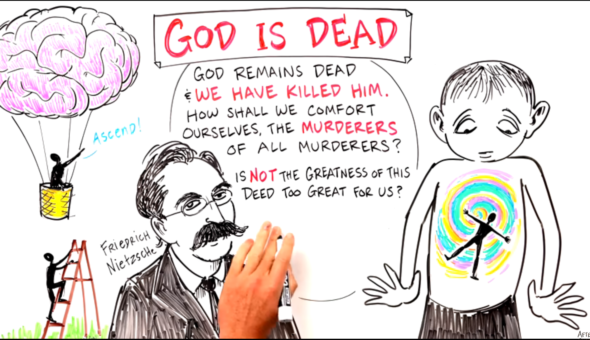

# Greatness of this Deed too Great for US?

&nbsp;

Again, in another way, stored inband, outband. Is this *deed* from the founding fathers too great for the USA and Pale Blue Dot?

&nbsp;

# Dive Deeper 

Source     
https://youtu.be/np6n_95u-kk?t=232     
Are We Waking Up a New God? - Agrippa's Diary      
After Skool     

* "We cannot change the world. But we can change ourselves...and that will change the world. The goal of this channel is to empower the individual and deliver profound ideas through art. Everyone is welcome to contribute. If you have a good idea for an animation *please send them to Mark* at AfterSkool100@gmail.com "

&nbsp;

"Significant climate shifts did occur in Africa around that time (the end of the Younger Dryas period, about 11,600 years ago), which led to the desiccation of the Sahara and drew populations towards the Nile Valley, forming the basis of later Egyptian civilization."     
On the Great Seal of the United States of America, plants grow on the front side of the pyramid, on the Nile River. Context assertions, climbing the ladder higher, climbing the pyramid higher with our minds. Working together to peer to peer public dreams together. OPERA_A Pushing the barrier. https://www.youtube.com/watch?v=bVYXWVs0Prc Chanting the Mantra of the left claw of the eagle on the Great Seal of the United States of America. Lifting the veil of the Tree of Knowledge, some call it the Search for The Grail... and you know that for sure! 24,078,143 views December 18, 2016 ... published on YouTube in holiday seasons. Projecting out images in space and time.
