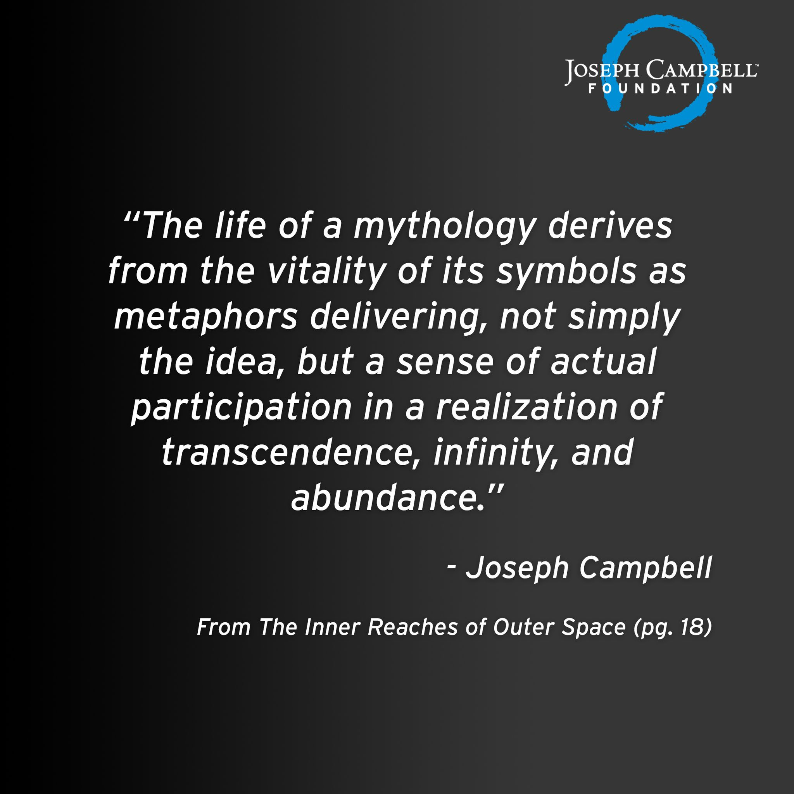

# Experience *Pluribus* Project 

The Great Seal of the United States of America *Experience* Project.

We The People Experience. Are *you*, have you *been* taught by the experienced? https://www.youtube.com/watch?v=rD6y7aOS0NA 1,384,197 views February 7, 2017

* “Like to do a thing that was recorded in 1733 in the Benjamin Franklin Studio, a thing called ‘Spanish Castle Magic.’“  ~ Jimi Hendrix [January 9, 1969 in Stockholm Sweden](https://www.jimihendrix.com/editorial/recorded-in-1733-from-the-benjamin-franklin-studio-jimi-hendrix-live-in-stockholm-sweden/)

&nbsp;

# Participation /  Experience

"The life of a mythology derives from the vitality of its symbols as
metaphors delivering, not simply the idea, but a sense of actual participa­tion in such a realization of transcendence, infinity, and abundance, as this
of which the upanishadic authors tell. Indeed, the first and most essential
service of a mythology is this one, of opening the mind and heart to the
utter wonder of all being. And the second service, then, is cosmological: of
representing the universe and whole spectacle of nature, both as known to
the mind and as beheld by the eye, as an epiphany of such kind that when
lightning flashes, or a setting sun ignites the sky, or a deer is seen standing
alerted, the exclamation "Ah!" may be uttered as a recognition of divinity.
This suggests that **in the new mythology, which is to be of the whole
human race**, the old Near Eastern desacralization of nature by way of a
doctrine of the Fall will have been rejected" - Inner Reaches of Outer Space, year 1986, book page 18
