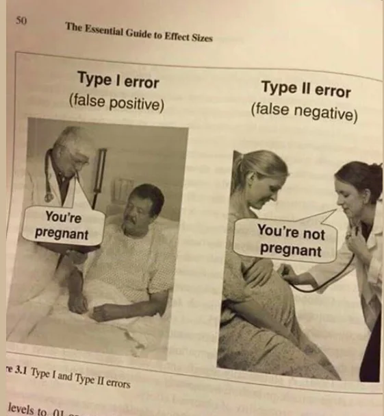

# Everything *is* **Lady** Day 

Everything Season One has been about March 25 or thereabouts.

Springtime Egg Basket fertilization metaphors. March 25, rabbit [test](https://en.wikipedia.org/wiki/Testicle)ing abounds. Walter White... mad scientists, military lab rats, turkey baster payload injections.

&nbsp;

&nbsp;

# Hive Mind Wikipedia 

**Lady Day** on Wikipedia     
https://en.wikipedia.org/wiki/Lady_Day

Walter White is rather meticulous in his clean cooking. But the ladies at the Zero Hour bring to the table the ultimate inception of reformation of conceptions. Now *who* conceived of sin, 1132? The value 32 feet per second squared (ft/s²) is the approximate acceleration due to gravity near the Earth's surface in U.S.A. customary units. What has [fallen](https://en.wikipedia.org/wiki/Fall_of_man) from the sky, Chicken Little? What eggs were nesting on ICE?

Mr White may be a clean freak, but he is no Jesus freak. And we should be freaking out about Jesus. Especially the way fandoms of Levant science fiction trilogy behave.

It is as if March 25 and December 25 are ass-backwards. Inverted, fucked-up beyond all *belief* and recognition! 

Have our science teachers in high school been flipping the bits? https://thesethingsinside.wordpress.com/2013/04/18/joseph-campbell-says-religious-literalism-sets-satan-in-the-seat-of-god/

Does Mr. White not know his teachings and aspirational fandoms, *mantras*,  matter? Is the car-wash racket white-washing the situation of a military lab cooking up augmented outer-space RNA? How do we stop the fandom of mad scientists from wrecking *Us All* with their [crooked](https://youtu.be/1jeyIAH3bUI?t=574) Levant science fiction interpretations of *who* originated sin? https://www.The-Scientist.com/mirror-microbes-could-end-all-life-on-earth-how-do-we-stop-them-73425

These paradoxes of *who* 1132 abounds and rebounds. Is Carol with pen and whiteboard in hand, standing upon the grave site of Mr. White's science [fix](https://youtu.be/1jeyIAH3bUI?t=691)ations?

&nbsp;

&nbsp;

&nbsp;

&nbsp;

# Legendary Science Fiction

Outer space alien angels impregnated December 24 / December 25 when Pluribus Season One ends symbolically.

&nbsp;

Two lesbians getting pregnant story, and a 78 second human body message from Kepler 22B outer-space planet. There are parallels to this story if you shift the date to March 25 instead of December 25 and the 9 months to get frozen stem cells on ice to birth out of woman's body. A *rebirth* legend, story *born again* mythology of We The People, Pluribus.

Are men *telling stories*? Did men write and share and author the *legendary story* of December 25?

*Birds and Bees* lessons, wildlife returning to ABQ. But fiction storytelling outsells nonfiction learning.
