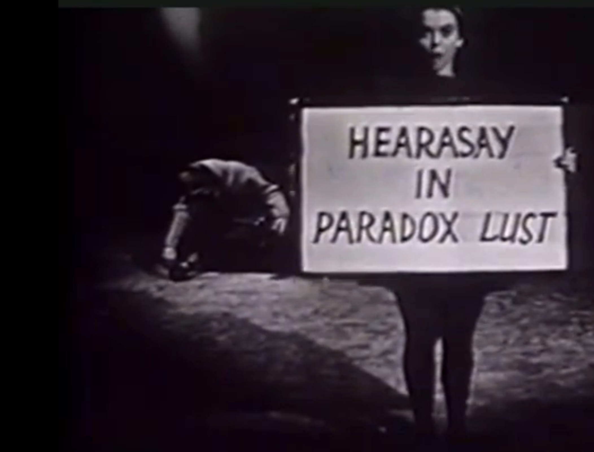

# Christmas *Hole In One!*

Carol golfs.

&nbsp;

https://old.reddit.com/r/OneThingIs/comments/1pupq79/vince_gilligans_pluribus_plur1bus_the_greatest/

**Vince Gilligan's Pluribus / PLUR1BUS - The Greatest Ever! Heart expanding Christmas landing. ▲ We is Us: "We are at this moment participating in one of the very greatest leaps of the human spirit"**

&nbsp;

Rest in peace Bill Moyers, who died this year. June 26, 2025 at the age of 91. May the force be with you, always! From year 1988:

&nbsp;

# .

how are our imaginations to be nourished? By **Hollywood and made-for-TV** movies?

Campbell was no pessimist. He believed there is a “point of wisdom beyond the conflicts of illusion and truth by which lives can be put back together again.”

Finding it is the “prime question of the time.” In his final years he was striving for a new synthesis of science and spirit.

“The shift from a geocentric to a heliocentric world view,” he wrote after the astronauts touched the moon, “seemed to have removed man from the center — and the center seemed so important. Spiritually, however, the center is where sight is. [Stand on a height and view the horizon](https://www.youtube.com/watch?v=0sU59BBSskY). Stand on the moon and view the whole earth rising — **even, by way of television**, in your parlor.”

The result is an unprecedented expansion of horizon, one that could well serve in our age, as the ancient mythologies did in theirs, to cleanse the doors of perception “to the wonder, at once terrible and fascinating, of ourselves and of the universe.”

He argued that it is not science that has diminished human beings or divorced us from divinity. On the contrary, the new discoveries of science “rejoin us to the ancients” by enabling us to recognize in this whole universe “a reflection magnified of our own most inward nature; so that we are indeed its ears, its eyes, its thinking, and its speech — or, in theological terms, God’s ears, God’s eyes, God’s thinking, and God’s Word.”

The last time I saw him I asked him if he still believed — as he once had written — “that we are at this moment participating in one of the very greatest leaps of the human spirit to a knowledge not only of outside nature but also of our own deep inward mystery.”

He thought a minute and answered, ***“The greatest ever!”***

&nbsp;

&nbsp;

# .

&nbsp;

"Billy Don Moyers (June 5, 1934 – June 26, 2025) was an American journalist and political commentator who served as the eleventh White House Press Secretary from 1965 to 1967 during the Lyndon B. Johnson administration. He also served as the de facto White House Chief of Staff for a brief period from 1964 until 1965. Moyers was a director of the Council on Foreign Relations from 1967 to 1974. "       
https://en.wikipedia.org/wiki/Bill_Moyers#Conflict_with_CPB_over_content

You served the Great Seal of the United States of America spiritual values very well Mr. Moyers. May We the People, All of Us, Pluribus - save the world from the Hell that has been unleashed since year 2013.  Love to All, Merry Christmas.

&nbsp;

&nbsp;

&nbsp;

&nbsp;

&nbsp;

&nbsp;

&nbsp;

&nbsp;

&nbsp;

&nbsp;

&nbsp;

&nbsp;

&nbsp;

&nbsp;

# The Greatest Ever!

&nbsp;

“The shift from a geocentric to a heliocentric world view,” he wrote after the astronauts touched the moon, “seemed to have removed man from the center — and the center seemed so important. Spiritually, however, the center is where sight is. [Stand on a height and view the horizon](https://www.youtube.com/watch?v=0sU59BBSskY). Stand on the moon and view the whole earth rising — **even, by way of television**, in your parlor.”

&nbsp;

# .

&nbsp;

"Pluribus — The Loneliest Sound In The World | Scene | Apple TV"       
38,776 views  December 19, 2025         
https://www.youtube.com/watch?v=0sU59BBSskY    

Something to do with the body's electric field.

&nbsp;

BILL MOYERS: So love is not love in general, it is love for that woman?

JOSEPH CAMPBELL: For that one woman. That’s right.

MOYERS: Why do you think we fall in love with one person and not another?

CAMPBELL: Well, I wouldn’t be one to say. It’s a very mysterious thing, that electric thing that happens, and then the agony that can follow. The troubadours celebrate the agony of the love, the sickness the doctors cannot cure, the wounds that can be healed only by the weapon that delivered the wound.

MOYERS: Meaning?

CAMPBELL: The wound is the wound of my passion and the agony of my love for this creature. The only one who can heal me is the one who delivered the blow.

&nbsp;

Interview George Lucas filmed at Skywalker Ranch California for science fiction audiences. [I think page 243 perfectly describes](https://www.google.com/books/edition/The_Power_of_Myth/cM5vDwAAQBAJ?hl=en&gbpv=1&dq=%22The+wound+is+the+wound+of+my+passion+and+the+agony+of+my+love+for+this+creature.%22&pg=PA243&printsec=frontcover) why Carol has gone back to her house at the end of the season to start the Rebels against the Empire. What Carol is standing up for, person to person love, not just generic love. Is *this* military approach* the **Minute 22** Episode One [post-doc Helen's skeleton key to the *wake* of the hive mind penetration?](https://en.wikipedia.org/wiki/A_Skeleton_Key_to_Finnegans_Wake). Earth Irish [Pride](https://www.youtube.com/watch?v=LHcP4MWABGY), the quantum gift to the cosmos? U2 is We, and Pluribus pen in hand?
 
&nbsp;

&nbsp;

# Hearasay in *Paradox Lust*

https://youtu.be/WoiJVkdDbOo?t=781      
2,398 views June 29, 2020     
"a selection from **Jean Erdman's** "The Coach with the Six Insides" (based on James Joyce's Finnegans Wake) performed on CBS's "Camera Three" in December 1964"     

Christmas 1964 [December 13](https://www.imdb.com/title/tt31080053/) TV show, 2025 Pluribus TV show themes.      
Hive Mind heresy. Christmas Eve Christmas Day [heresy](https://en.wikipedia.org/wiki/Heresy)!     
James Joyce year 1923 Finn's Hotel heresy against the Roman Empire Clergy Rulers (and measures) of the Dublin *ABQ* hivemind.     

Extracting the hive mind with lust and compassion. Minute 22 of Episode One of Pluribus is James Joyce's Finnegans Wake post-doc thesis of Helen in a *Public House*.     

Lesbian parenting, paradoxes abound in this lust! [Carol's Libido over hive mind credo!](https://billmoyers.com/content/ep-5-joseph-campbell-and-the-power-of-myth-love-and-the-goddess-audio/)

&nbsp;

&nbsp;

# Vince Gilligan Team Hits 13

In the 13th month, Vince Gilligan landed right on the Great Seal spot like the [image currently on the front-page of this GitHub project](/)! The stars alight, Page 581 of Finnegans Wake, year 1923 Finn's Hotel, ABQ from Dublin. Helen's post-doc thesis in the Public House at Minute 22 was a message to all the free worlds that Kepler 22 has a new King of Kings! Pluribus, We The People, Pale Blue Dot pride that Vince Gilligan has started to describe!

Latin Pluribus, 13th month retail of Apple iPhone / Apple iPad devices The Greatest Ever bonus of USA Great Seal mythology ever created! https://en.wikipedia.org/wiki/Thirteenth_salary   

Latin Pluribus. "The word undecimber is based on the Latin word undecim meaning "eleven"..." https://en.wikipedia.org/wiki/Undecimber Duodecember.

&nbsp;

&nbsp;

# Vince Gilligan Quotes 

Episode 9, Christmas Eve / Christmas Day quotes

https://variety.com/2025/tv/news/pluribus-finale-explained-vince-gilligan-original-ending-1236616824/

GILLIGAN: "Well, literally, the Others are very lawyerly."

Holiday overlords, Levant Christmas land fame.

JOSEPH CAMPBELL: It is this sociological function of myth that has taken over in our world—and it is out of date.

BILL MOYERS: What do you mean?

CAMPBELL: **Ethical laws. The laws of life** as it should be in the good society. All of Yahweh’s pages and pages and pages of what kind of clothes to wear, how to behave to each other, and so forth, in the first millennium B.C.
