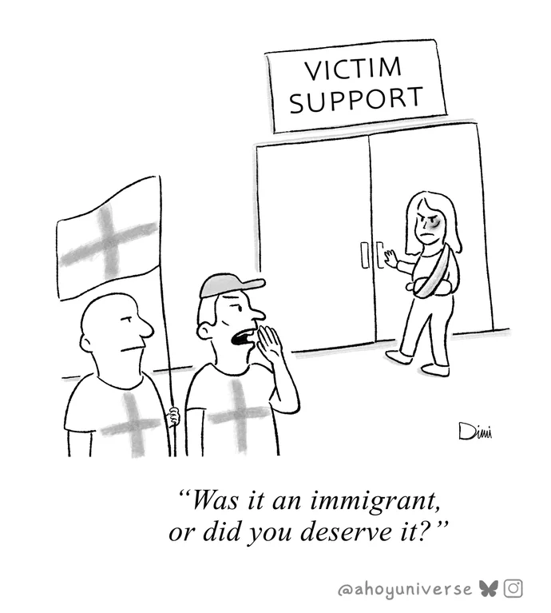

# Loaded Thinking

Loaded Question, that there are only two answers to a problem.

&nbsp;

comic source: https://redd.it/1nywh12

1. You deserved violence. Normalizing violence and hate. Avoiding the February 28, 1954 Equation.

2. Immigrants did it.

3. There is no third option, as bi-polar us vs. them mindset is thought-termining at two sides, both sides, "the other side" (of two sides). "Twi sides to every story".

In this case, both are wrong. Side one is wrong, side two is wrong. The correct answer lies beyond the numbers one and two, "both" sides.

